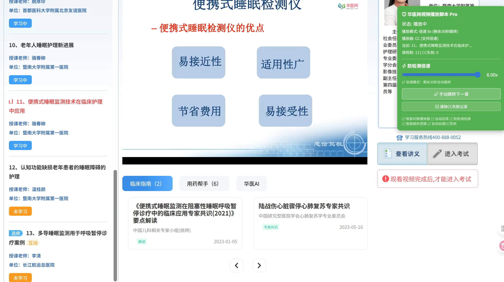
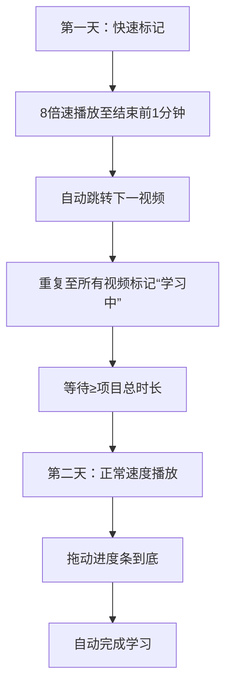
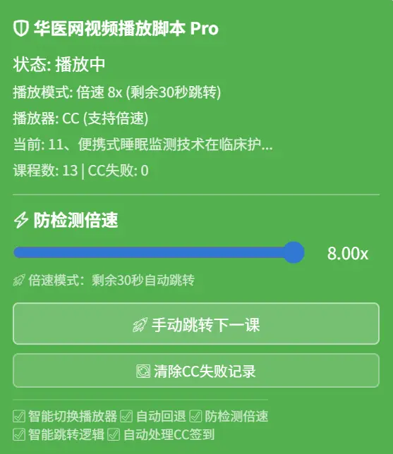

华医网视频播放脚本 Pro
==========================



2025/11/30 v1.3 强制切换到CC播放器，增加倍速功能与使用方法（注意最终等待的自然时长必须为1.0倍速的时长）；

2025/11/30 v1.2 自动跳转视频太慢，精简了业务逻辑；

2025/11/29 v1.1 测试通过，增加用户行为模拟，包括鼠标移动和点击；

2025/11/28 v1.0 测试通过，可以自动连续播放华医网视频，自动连续播放并完成2025广东公需课。

> 一个专为华医网设计的自动化视频播放脚本，支持无人值守观看视频。
> 
> 基于[🥇【华医网小助手】全网唯一真实免费|无人值守|自动静音|视频助手|考试助手|不疲劳](https://greasyfork.org/scripts/483418)，用AI优化，已删除答题模块；
> 
> 如要答题，请使用其它脚本，如：[华医网自动化考试助手 (V2.3.3 - Key优化版)](https://greasyfork.org/scripts/545001)。

#### 📥 安装步骤（3步搞定）
1. **安装油猴扩展**
   - Chrome/Edge: [Tampermonkey](https://www.tampermonkey.net/)
   - Firefox: [Greasemonkey](https://addons.mozilla.org/firefox/addon/greasemonkey/)
2. **安装脚本**
   - 点击脚本链接 [华医网视频播放脚本 Pro](https://greasyfork.org/zh-CN/scripts/557281-%E5%8D%8E%E5%8C%BB%E7%BD%91%E8%A7%86%E9%A2%91%E6%92%AD%E6%94%BE%E8%84%9A%E6%9C%AC-pro) → `安装脚本` → `确认安装`
3. **刷新页面**
   - 访问华医网任意页面 → 自动运行

#### 🎯 核心功能
1. **智能播放器切换**  
   - 自动检测播放器类型（优先CC播放器，支持倍速；失败回退Polyv播放器）
   - 记录CC失败课程，避免重复切换
2. **防检测倍速播放**  
   - 劫持`playbackRate`属性，对外始终显示1.0x
   - 支持0.5x-8.0x倍速（仅CC播放器）
   - 动态调整跳转时机（倍速越高检测越频繁）
3. **自动化学习流程**  
   - 自动播放下一个视频
   - 智能跳转逻辑（正常速度播放完等待5秒，倍速模式剩余240秒跳转）
   - 自动处理签到弹窗（10种弹窗类型）
   - 静音播放 + 用户行为模拟
4. **课程管理**  
   - 自动保存课程列表
   - 显示当前课程进度
   - 支持手动跳转下一课
---
#### ⚡ 倍速省时使用指南
**原理**：华医网时长计算 = 结束时间 - 开始时间（必须≥1.0倍速总时长）
**高效策略**：

**操作步骤**：
1. **第一天**  
   - 开启8倍速播放
   - 脚本自动跳转（剩余240秒即切下一视频）
   - 所有视频显示“学习中”状态后停止
2. **等待期**  
   - 等待时间 ≥ 项目总时长（如项目需10小时，则等10小时）
   - 无需保持页面开启
3. **第二天**  
   - 正常速度播放各视频
   - 拖动进度条到底（因等待时长足够，直接完成）
   - 满足证书申领时长要求
   **优势**：
- ✅ 绕过倍速检测（真实时长达标）
- ✅ 符合平台计算逻辑
- ✅ 比纯倍速更安全高效
---
#### 📋 浮窗控制



点击右下角圆球展开控制面板：
- 🎚️ **倍速调节**：0.5x-8.0x滑块（CC播放器生效）
- 🚀 **手动跳转**：立即切换下一视频
- 🔄 **清除记录**：重置CC失败课程列表
- 📊 **状态显示**：播放模式/课程数/播放器类型
> ⚠️ 注意：Polyv播放器不支持倍速，脚本会自动回退并提示
---
#### 🔧 技术实现
- **播放器劫持**：在`document-start`阶段劫持`HTMLMediaElement.prototype.playbackRate`
- **智能检测**：结合URL路径+DOM元素识别播放器类型
- **防检测机制**：`getOwnPropertyDescriptor`劫持隐藏修改痕迹
- **弹窗处理**：jQuery+原生JS双通道检测（2秒/次高频扫描）
```javascript
// 核心防检测代码示例
Object.defineProperty(HTMLMediaElement.prototype, 'playbackRate', {
  get: () => 1.0,  // 对外始终显示1.0x
  set: (value) => realPlaybackRate = value  // 实际设置真实倍速
});
```
---
#### 📌 注意事项
1. CC播放器失败课程会自动记录（避免重复切换）
2. 倍速模式跳转阈值 = 240秒 ÷ 当前倍速
3. 考试页面自动点击“立即学习”
4. 刷脸认证页面每5分钟自动刷新
> 💡 提示：使用分天策略可100%避免时长异常，证书申领更安全

--------------------------------
以上内容由AI生成，仅供参考和借鉴
