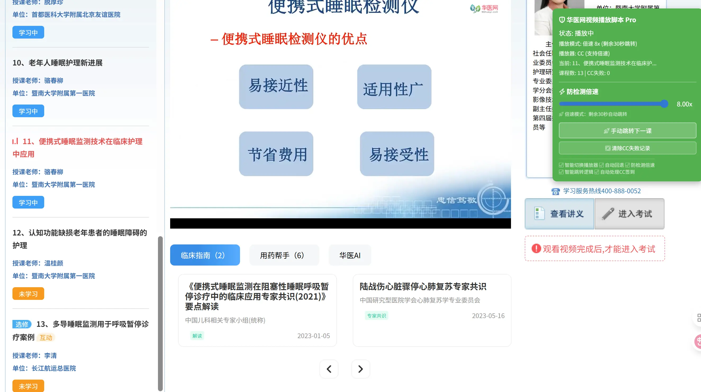
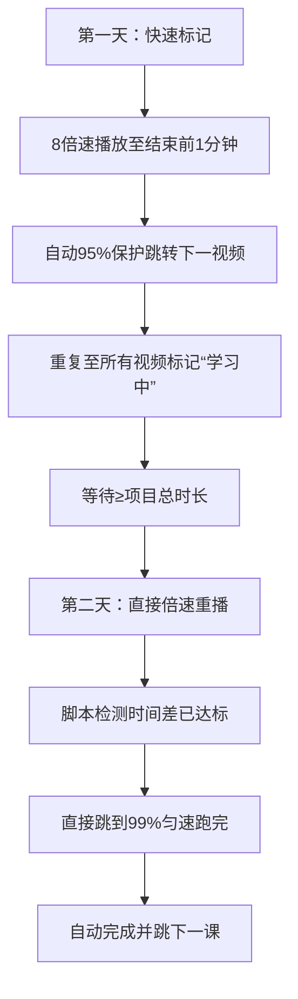
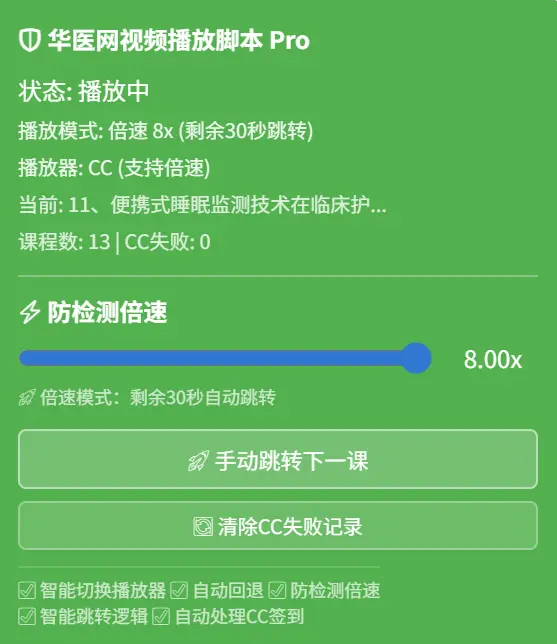

华医网视频播放脚本 Pro
==========================



2026/09/30 v1.5 分天策略全自动化：本地记录每课首次播放时间，时间差未达标时保持95%保护跳转（避免服务器重置开始时间）；达标后（当前时间 ≥ 首播时间+视频真实时长）不管进度条在哪，直接跳到99%并以1.0x匀速跑完自动完成课件；基于CC播放器源码（h5player-3.6.2.js）逆向重构达标跳转：确认播放器存在反快进看门狗（banDrag && 单次前进>2秒 && 超过已看最大时间 → 强制回退），这是直接改currentTime和模拟点击进度条都无效的根因，改用播放器官方API `cc_js_Player.jumpToTime()` 跳99%（其内部先同步lastVideoTime再seek，看门狗前进量恒为0永不回退，华医网页面自己就用它做续播），已达99%时1.0x匀速、API不可用时自动退为8x自然播放；同时拦截页面的反插件检测器（isTrusted合成点击检测：签到按钮/切换课程按钮命中即销毁播放器），保障签到弹窗自动处理安全；课件结束页（exam_result.aspx）自动标记完成并续播下一课；弹题按CC真实DOM结构处理：答对自动点"继续播放"（#rightBtn），答错自动点"回看知识点"（#wrongBtn）、弹题重现后换未试过的选项重答（错题记忆），全部失败自动跳过；修复结束页续播404：课程首页(course.aspx)直接解析 data-href 真实课件地址（/course_ware/ 目录），记录课程cid，跳转失败自动返回课程首页；浮窗新增"默认首次观看时间"设置（老用户补录：之前手动看过的课填当时开始时间，二刷逻辑立即生效；设置时自动清除旧的精确首播记录，修复补录后被旧记录覆盖导致仍走95%保护的问题）；完成模式跳99%前自动等待弹题处理完毕（3秒防抖），修复与弹题反复拉扯、进度条闪烁无法播完的问题；悬浮球支持拖动（拖动阈值5px防误触，位置自动记忆）；新增CC播放器自带投票弹窗（.ccVoteContainer）自动处理：自动选择并提交/跳过，修复越过投票时间点被播放器强制暂停导致达标跳转反复回退、单节课无法完成的问题（投票时间点在95%~99%之间时仅二刷触发）；完成模式新增跳转未保持熔断（连续3次回退后停止跳转改用8x自然播放推进）与播放停滞自动恢复（10秒无进展强制恢复播放）；修复弹题答对后未点击"继续播放"导致播放器答题登记缺失、每次越过题目时间点即被拉回强制暂停的死循环（判定逻辑改为结果驱动：必须点击#rightBtn登记作答，弹窗消失未确认登记时走"跳过"通道兜底）；修复判题延迟场景下把已答对的题改选成错误答案的问题：提交后轮询判题浮层最长约7秒再决定重答，且任何改选/重答前必须先经过结果浮层统一处理（答对点继续播放、答错记错题点回看，2.5秒点击节流）；修复浮窗按钮（清除默认时间等）点击失灵：展开状态下面板内任何mouseup都会收起面板，按钮在click派发前被移除导致点击丢失（拖拽逻辑改为仅悬浮球点击展开，面板内按钮/输入框不再触发拖拽，按钮事件改为一次性事件委托不受innerHTML重建影响）；默认首播时间新增24小时有效期（防止忘记清除导致新课程被误判达标直接跳99%，旧格式数据自动失效），避免异常完成速度触发播放器插件检测；新增课程级总时长考核：系统按课程所有课件时长之和考核学习总时间（学分申请同口径），脚本按课件页内嵌cid记录每门课程的课程首播时间（取最早开始播放的课件时间，补录场景沿用默认首播时间），并逐个观察记录各课件时长累加为课程总时长；完成模式达标判定升级为双重考核——单视频时长达标 且 课程总时长（课程首播时间+Σ课件时长≤当前时间）同时达标才允许跳99%完成，倍速省下的时间必须用真实时间差补回来，总时长不够时保持95%保护（大课程自动等到第二天/第三天）；课程全部课件完成后自动重置课程级计时（重修时重新累计）；浮窗状态行显示课程总时长考核进度与剩余等待时间；时间差考核统一留10%冗余（单视频与课程总时长均按×1.1判定，防止边界误差导致服务器判定不通过）；

2026/09/30 v1.4 新增中途弹题自动作答：检测CC播放器弹题弹窗，模拟真人点击作答（判断题优先选"正确"），答错自动换选项，错题记忆避免重复踩坑，全部失败自动点击隐藏"跳过"按钮兜底；同时新增匹配 bokecc.com 域名，弹题期间不再强制恢复播放；

2025/11/30 v1.3 强制切换到CC播放器，增加倍速功能与使用方法（注意最终等待的自然时长必须为1.0倍速的时长）；

2025/11/30 v1.2 自动跳转视频太慢，精简了业务逻辑；

2025/11/29 v1.1 测试通过，增加用户行为模拟，包括鼠标移动和点击；

2025/11/28 v1.0 测试通过，可以自动连续播放华医网视频，自动连续播放并完成2025广东公需课。

> 一个专为华医网设计的自动化视频播放脚本，支持无人值守观看视频。
> 
> 基于[🥇【华医网小助手】全网唯一真实免费|无人值守|自动静音|视频助手|考试助手|不疲劳](https://greasyfork.org/scripts/483418)，用AI优化，已删除答题模块；
> 
> 如要答题，请使用其它脚本，如：[华医网自动化考试助手 (V2.3.3 - Key优化版)](https://greasyfork.org/scripts/545001)。

#### 📥 安装步骤（3步搞定）
1. **安装油猴扩展**
   - Chrome/Edge: [Tampermonkey](https://www.tampermonkey.net/)
   - Firefox: [Greasemonkey](https://addons.mozilla.org/firefox/addon/greasemonkey/)
2. **安装脚本**
   - 点击脚本链接 [华医网视频播放脚本 Pro](https://greasyfork.org/zh-CN/scripts/557281-%E5%8D%8E%E5%8C%BB%E7%BD%91%E8%A7%86%E9%A2%91%E6%92%AD%E6%94%BE%E8%84%9A%E6%9C%AC-pro) → `安装脚本` → `确认安装`
3. **刷新页面**
   - 访问华医网任意页面 → 自动运行

#### 🎯 核心功能
1. **智能播放器切换**  
   - 自动检测播放器类型（优先CC播放器，支持倍速；失败回退Polyv播放器）
   - 记录CC失败课程，避免重复切换
2. **防检测倍速播放**  
   - 劫持`playbackRate`属性，对外始终显示1.0x
   - 支持0.5x-8.0x倍速（仅CC播放器）
   - 动态调整跳转时机（倍速越高检测越频繁）
3. **自动化学习流程**  
   - 自动播放下一个视频
   - 智能跳转逻辑（时间差未达标：95%保护跳转；达标：100%播完跳转；正常速度播放完等待5秒）
   - 课件结束页（`exam_result.aspx`）自动标记完成并续播下一课
   - 自动处理签到弹窗（10种弹窗类型）
   - 静音播放 + 用户行为模拟
4. **中途弹题自动作答（v1.4 新增）**  
   - 检测CC播放器播放中途的答题弹窗（`.ccQuestionBox`）
   - 模拟真人点击（mousedown → mouseup → click）选择答案并提交
   - 按CC真实DOM结构处理结果（v1.5）：答对自动点"继续播放"（`#rightBtn`）；答错自动点"回看知识点"（`#wrongBtn`），弹题重现后换未试过的选项重答
   - 错误答案记入 localStorage，下次遇到同一题直接避开
   - 所有选项都失败时，强制点击隐藏的"跳过"按钮（`#ccJumpOver`）兜底并恢复播放
5. **分天时间达标完成（v1.5 新增）**  
   - 本地记录每课首次播放时间（`huayi_first_play`）
   - 服务器按「结束时间-开始时间 ≥ 视频真实时长」计算有效学习，与倍速无关
   - 时间差未达标：只播到95%即跳转，避免服务器重置开始时间
   - 时间差达标：不管进度条在哪，通过CC播放器官方API `jumpToTime()` 直接跳到99%并以1.0x匀速跑完（45分钟课件仅约27秒）；API不可用时自动退为8x自然播放推进
   - 老用户补录：浮窗可设置"默认首次观看时间"，之前手动看过的课二刷逻辑立即生效（设置时自动清除旧的精确首播记录，避免旧记录优先导致默认时间不生效）
   - 课程完成后自动清除计时记录，重修时重新计时
6. **课程管理**  
   - 自动保存课程列表
   - 显示当前课程进度
   - 支持手动跳转下一课
---
#### ⚡ 倍速省时使用指南
**原理**：华医网时长计算 = 结束时间 - 开始时间（必须≥1.0倍速总时长）
**高效策略**（v1.5 起第二天全自动完成）：

```mermaid
graph TD
    A[第一天：快速标记] --> B[8倍速播放至结束前1分钟]
    B --> C[自动95%保护跳转下一视频]
    C --> D[重复至所有视频标记“学习中”]
    D --> E[等待≥项目总时长]
    E --> F[第二天：直接倍速重播]
    F --> G[脚本检测时间差已达标]
    G --> H[直接跳到99%匀速跑完]
    H --> I[自动完成并跳下一课]
```
**操作步骤**：
1. **第一天**  
   - 开启8倍速播放
   - 脚本自动95%保护跳转（时间差未达标，剩余240÷倍速秒即切下一视频）
   - 所有视频显示“学习中”状态后停止
2. **等待期**  
   - 等待时间 ≥ 项目总时长（如项目需10小时，则等10小时）
   - 无需保持页面开启
3. **第二天（v1.5 全自动）**  
   - 直接倍速重播各视频即可，无需手动拖进度条
   - 脚本检测本地记录的首播时间差已达标后，不管进度条在哪直接跳到99%
   - 以1.0x匀速跑完最后1%自动完成，并续播下一课
   - 满足证书申领时长要求
   **优势**：
- ✅ 绕过倍速检测（真实时长达标）
- ✅ 符合平台计算逻辑
- ✅ 比纯倍速更安全高效
---
#### 📋 浮窗控制



点击右下角圆球展开控制面板（圆球可按住拖动到任意位置，位置自动记忆；单击展开/收起）：
- 🎚️ **倍速调节**：0.5x-8.0x滑块（CC播放器生效）
- 🚀 **手动跳转**：立即切换下一视频
- 🔄 **清除记录**：重置CC失败课程列表
- 📊 **状态显示**：播放模式/课程数/播放器类型
> ⚠️ 注意：Polyv播放器不支持倍速，脚本会自动回退并提示
---
#### 🔧 技术实现
- **播放器劫持**：在`document-start`阶段劫持`HTMLMediaElement.prototype.playbackRate`
- **智能检测**：结合URL路径+DOM元素识别播放器类型（脚本同时匹配`91huayi.com`与`bokecc.com`域名）
- **防检测机制**：`getOwnPropertyDescriptor`劫持隐藏修改痕迹
- **弹窗处理**：jQuery+原生JS双通道检测（2秒/次高频扫描）
- **弹题作答**：1秒轮询 + MutationObserver即时检测（500ms节流），错题记录localStorage持久化；答对点"继续播放"（#rightBtn），答错点"回看知识点"（#wrongBtn）后弹题重现自动换选，全部失败走"跳过"（#ccJumpOver）兜底
- **分天策略**：localStorage记录每课首播时间（`huayi_first_play`），`当前时间 ≥ 首播时间 + 视频时长`即判定达标，达标前95%保护跳转、达标后直接跳99%匀速（1.0x）跑完
- **结束页续播**：`exam_result.aspx` 自动标记完成并续播下一课；课件地址优先取课程列表保存的真实链接（课程首页 `data-href` 的 `/course_ware/` 相对路径按列表页目录解析），兜底 `origin + /course_ware/`；15秒未跳转自动返回课程首页
```javascript
// 核心防检测代码示例
Object.defineProperty(HTMLMediaElement.prototype, 'playbackRate', {
  get: () => 1.0,  // 对外始终显示1.0x
  set: (value) => realPlaybackRate = value  // 实际设置真实倍速
});
```
---
#### 📌 注意事项
1. CC播放器失败课程会自动记录（避免重复切换）
2. 时间差未达标时：倍速模式跳转阈值 = 240秒 ÷ 当前倍速（95%保护跳转）
3. 时间差达标判定：本地记录首次播放时间，`当前时间 - 首播时间 ≥ 视频真实时长`后，不管进度条在哪通过 `cc_js_Player.jumpToTime()` 直接跳到99%以1.0x匀速跑完（该API内部同步lastVideoTime，可绕过播放器反快进看门狗；直接改currentTime/模拟点击都会被回退）；记录存于 localStorage（`huayi_first_play`），课程完成后自动清除；老用户可在浮窗设置"默认首次观看时间"（`huayi_default_first_play`，对所有无精确记录的课程生效）；脚本在document-start拦截页面的isTrusted反插件检测器，保障合成点击（签到弹窗等）不被"检测到异常插件"机制销毁播放器
4. 课件结束页（exam_result.aspx）自动续播下一课，10秒未跳转则点击"立即学习"兜底
5. 刷脸认证页面每5分钟自动刷新
6. 中途弹题全自动作答：判断题优先选“正确”，答对自动点"继续播放"，答错自动点"回看知识点"、弹题重现后自动换选项重答；错题记录存于 localStorage（`huayi_question_attempts`），可在控制台清除后重置
> 💡 提示：使用分天策略可100%避免时长异常，证书申领更安全

--------------------------------
以上内容由AI生成，仅供参考和借鉴
